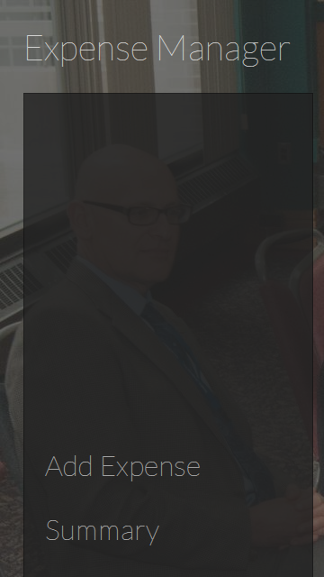
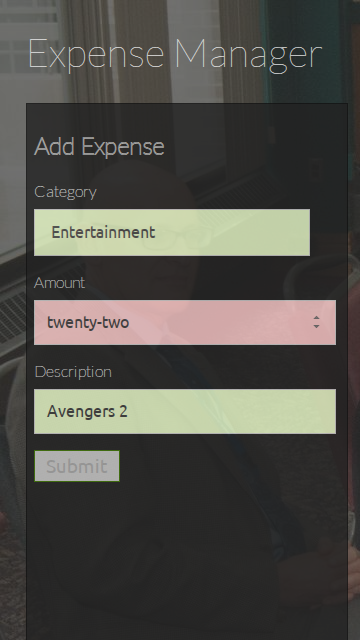
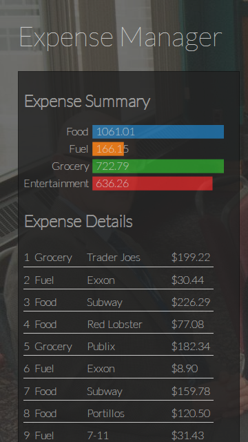
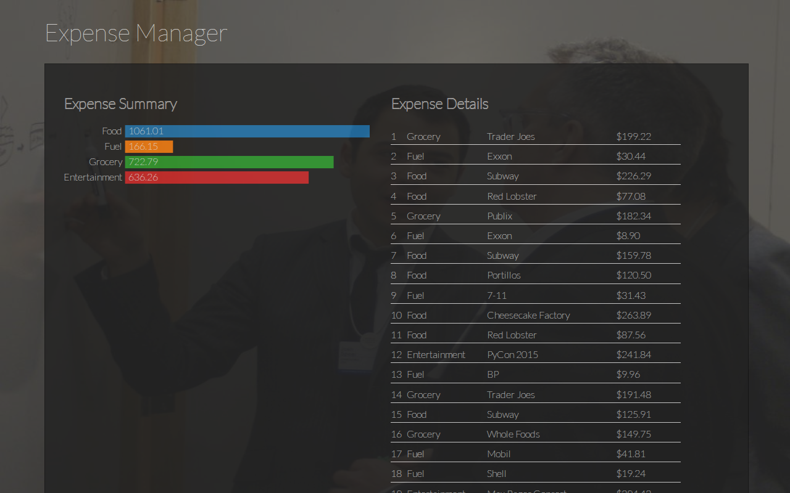

# Expense Manager

Live @ https://bionikspoon-expense-manager.herokuapp.com/

**Pro Tip:** Hit F12 to open your console.  Type "migrate" to populate a bunch of mock data.

## The Project

This project uses angular to create a mobile expense manager app. Data is stored in localStorage and graphed using the d3 library from http://d3js.org/. 

## Screens

